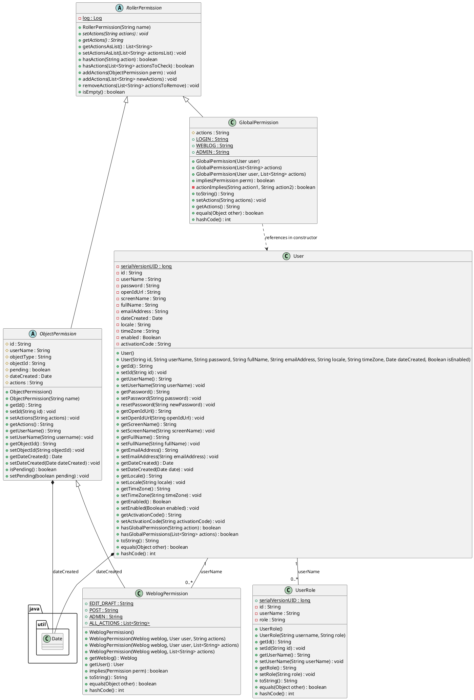

# LLM Analysis 

## Classes and Their Responsibilities

## 1. Permission Hierarchy Classes
These classes collectively implement a Java Security–style permission model that governs what actions a user is allowed to perform.

| Class | Responsibility | Data Owned | Behavior | Category |
| --- | --- | --- | --- | --- |
| **`RollerPermission`** | Root abstraction for all permissions. Standardizes how action strings are represented and evaluated. | None (abstract). | Parses comma-separated action strings, converts them to lists, checks for actions, and supports adding/removing actions. | **Base Domain Model** |
| **`ObjectPermission`** | Binds permissions to a specific domain object and user identity. | ID, `userName`, `objectType`, `objectId`, `pending`, `dateCreated`, actions. | Metadata accessors and persistence-related state handling. | **Domain Entity (Persistent)** |
| **`GlobalPermission`** | Represents system-wide permissions. | Actions such as `login`, `weblog`, `admin`. | Implements implication logic (e.g., `admin` implies `login`). | **Domain Model** |
| **`WeblogPermission`** | Manages permissions scoped to a specific weblog. | `Weblog`, `User`, action list. | Enforces hierarchical weblog access rules (`ADMIN` ⇒ `POST` ⇒ `EDIT_DRAFT`). | **Domain Entity (Persistent)** |

### Boundary of Responsibility (Permissions)
These classes are descriptive permission models only. They should **not**:
- Perform database access  
- Throw access-denied exceptions  
- Control request or UI flow  

Enforcement is expected to occur in service layers, managers, or security filters.

## 2. User & UserRole Classes
These classes represent identity and role assignment.

### **User**
- **Responsibility:** Represents a registered user.
- **Data Owned:** Credentials, profile data, preferences, and account status.
- **Behavior:**
  - Defensive copying of mutable fields (`Date`)
  - Input sanitization to prevent XSS
  - Password reset using a `PasswordEncoder`
  - Lightweight global permission checks
- **Category:** **Domain Entity**

### **UserRole**
- **Responsibility:** Maps a user to a role.
- **Data Owned:** ID, `userName`, role.
- **Behavior:** Implements `equals`, `hashCode`, `toString`.
- **Category:** **Domain Entity (Join/Mapping)**

## Summary of Core Logic: `implies()` Method
The permission hierarchy is enforced through the `implies()` method:

- `ADMIN` ⇒ `POST`
- `POST` ⇒ `EDIT_DRAFT`
- Global `ADMIN` ⇒ full system access

This logic is centralized inside permission classes, reducing duplication elsewhere.

### Boundary of Responsibility (User / UserRole)
The `User` class should not contain business logic related to content creation or moderation. It is limited to identity, profile management, and simple permission checks.

---

## Relationships Between Classes
The following relationships enable hierarchical security and persistent identity management.

## 1. Inheritance Relationships
| Superclass | Subclass(es) | Purpose |
| --- | --- | --- |
| `java.security.Permission` | `RollerPermission` | Aligns Roller permissions with Java Security. |
| `RollerPermission` | `ObjectPermission`, `GlobalPermission` | Shares action-handling logic. |
| `ObjectPermission` | `WeblogPermission` | Adds object-level metadata for weblog permissions. |

## 2. Composition Relationships
- **`User` ⭘— `Date` (`dateCreated`)**  
  User owns its creation timestamp and protects it via defensive copying.
- **`ObjectPermission` ⭘— `Date` (`dateCreated`)**  
  Permission records own their creation timestamp.

## 3. Association Relationships
### User ↔ UserRole
- **Multiplicity:** 1 to 0..*
- **Mechanism:** String-based `userName`
- **Purpose:** Allows multiple roles per user.

### User ↔ GlobalPermission
- **Multiplicity:** Contextual 1 to 1
- **Mechanism:** Instantiated with a `User`
- **Purpose:** Determines system-wide access.

### WeblogPermission ↔ User / Weblog
- **Multiplicity:** Many to One
- **Mechanism:** `userName` and `objectId`
- **Purpose:** Defines per-weblog permissions.

### Multiplicity Summary
| Association | Multiplicity | Description |
| --- | --- | --- |
| User → UserRole | 1 → 0..* | Multiple roles per user. |
| User → WeblogPermission | 1 → 0..* | Multiple weblog permissions per user. |
| Weblog → WeblogPermission | 1 → 0..* | Multiple users per weblog. |

---

## Class Diagram (PlantUML)

![LLM PlantUML Class Diagram](https://cdn-0.plantuml.com/plantuml/png/nLTHRzis47xNho2oXzbTRAnx38gYJfmM1hmaS9mLs4j1IrU77ILw99sWoFBVHv4YpVDfNWCFwuijVVTznzFTYKUzCvPhkwrbyMDHy9MncfUMbP8RmnPAIj0te6jXZ50DUof6xCa9h2YVcLHhTiRcQbtyH9Y3Mwj5isODhs7ex4_HypCpO2UbTHmJIJpS3fst1oKgJ5_lw2qXI1nbXq_CN1ZhhUt5cq1vwpXcdvFRux8jbYrzpqtGuEXQnaef2Rp9IQRNvL9Tt4Fv1zRmgegQwzKNA6sMrusxZ34aAdNVmEE4v4f3hHxWS3WBpyb4mbpM6_jra8VuJEfFudmgVc2YIcLmTri3-ieLESUKbos_RdhG6L9leAdSrIu8XrNSmeK6zzjIf-xVWTsJP0r0WXiC2KZxS0qk0jn8feKYJrHPahwXKm-rvrsN6h9SCWJGvz07YDpwHw7HPeO0fiHY-JIbCNXexxqUMThhFEEeHMv2TL2JU0_Hq86nZ4diEYaqq0UfLboY1kgjPTfJvjSVPbUzbe-NvyxOQvfCVqKYikoWpRXFyx37sllE30-wEMN_f17rHWem0_fofnIEEluiK75llJvbwFuNd7ohWXKtnJ6D2dzkkOnR4bFs7ZJPw-ulL0LU9Xgxg-v7M4crHjNDgd8vdIq_JHUJzylUejrStouFLvDQvlDFaulbxFhgbkpr99Z1i0yC07lqVwSiAoXEtCl4A9QNkEZN-M85fa-wlyms5G-s5z_IRxHhZg-yNnmV1XmWkFmDT1l2tMpg55AvPKPeNepel73OnhbyL1hnr0QQMNMdPGwQKWCq-_BFModtCQYva9Egqc1CZjFXua2fIYwHt8eQVbSDTjdmbVIoS_GYF_2sR6sUykI6EiMBD5rYdwKyH20b8G7niIA0dYc1FlR4YO4xO7zdFurXjxC_FChB1kBBXvg_n_ARxYc9F1dsqe4EEZsy1XuZj3S-OmEHfP8b3T08O0-tgTk8YymKuAmriPFteOhKHJBavIRoowpcn0KozZJ9KGS2B9xxDYCHT33gHInSXeQaqcJ0dRidxphLgy_p8qWqT61yE-d0Iwyd3G6Rq-X4AFuo82U2Gzy8bDv_FFyVzkg5ewNfVFH-hPKaUzr2jUsHt-33RTgYlFexx3mk9YhrO1vNaloNTI2VqM_-6et8fqe_ZHn2YwX3D7BIA0e_eryvqnV-mCTRA-JOlznd-LIWtlvL4HoVl3vXZddoytZywcJNOsSf-pqq4cHE9vyAu_5RxzUHD7m63Kq9ngMKbQenLczBgtJn3ffgMyk_0G00)

---

## Strengths

### Standardized Security Abstraction
The design builds on the standard `java.security.Permission` framework, enabling a consistent and extensible authorization model across the system. This alignment with Java’s native security abstractions improves clarity and interoperability.

**Relevant Classes:** `RollerPermission`, `GlobalPermission`, `WeblogPermission`, `ObjectPermission`

### Hierarchical Permission Logic
Access control rules are encapsulated directly within the domain model through the `implies()` method. This allows higher-level permissions to automatically grant lower-level privileges, reducing conditional logic elsewhere in the application.

**Relevant Classes:** `GlobalPermission`, `WeblogPermission`

### Strong Encapsulation
Mutable internal state, particularly `Date` fields, is protected through defensive copying. This prevents external callers from accidentally modifying internal object state and preserves data integrity.

**Relevant Classes:** `User`, `ObjectPermission`

### Centralized Action Handling
Action parsing, validation, and evaluation are centralized in the permission hierarchy. This avoids duplication and ensures that all permission types follow the same rules for action management.

**Relevant Classes:** `RollerPermission`, `GlobalPermission`, `WeblogPermission`

---

## Weaknesses

### High Coupling
Several domain entities rely on external managers and factory methods to resolve data or behavior. This tight coupling makes the classes harder to test in isolation and reduces modularity.

**Relevant Classes:** `User`, `GlobalPermission`, `WeblogPermission`

### Single Responsibility Principle (SRP) Violations
The `User` class takes on multiple responsibilities, including identity management, credential handling, account activation, and permission checks. This increases complexity and makes the class harder to maintain and extend.

**Relevant Classes:** `User`

### String-Based Associations
Key relationships are maintained using string identifiers (such as `userName`) rather than object references. This weak form of association risks referential integrity issues if identifiers change.

**Relevant Classes:** `User`, `UserRole`, `ObjectPermission`, `WeblogPermission`

### Redundant State in Permission Hierarchy
`ObjectPermission` introduces metadata fields that are inherited by all subclasses, even when not all fields are relevant. This adds unnecessary complexity to subclasses and persistence logic.

**Relevant Classes:** `ObjectPermission`, `WeblogPermission`

---

## What I Modified or Added Beyond the LLM Suggestions

### 1. Turning Code into Clear Responsibilities
The code defines classes like `User`, `UserRole`, `GlobalPermission`, and `WeblogPermission`.  
I explained it as classes that manage:
- User identity  
- Roles  
- Permissions and access control  

### 2. Simplifying Permission Logic
The permission checks in the `implies()` method contain conditional logic.  
I explained this logic as a **permission hierarchy**, where higher permissions automatically include lower ones.

### 3. Explaining Why Utility Code Exists
Permissions are stored as comma-separated strings and later converted into lists.  
I explained this as a design choice:
- Databases store simple strings easily  
- Application logic needs structured data  
This shows why utility methods are important.

### 4. Applying Design Judgment
Based on the code, I identified design strengths and weaknesses in simple terms.  
For example, I explained why the `User` class may be doing too many things and how that can affect maintainability.

### 5. Making the UML Diagram Accurate
I made sure the UML diagram matches the actual code exactly.  
I did not add any extra fields or relationships and kept it strictly based on what exists in the source files.

---

## Time Spent

- **Total time spent on analysis:** _2.5 hours_

---
