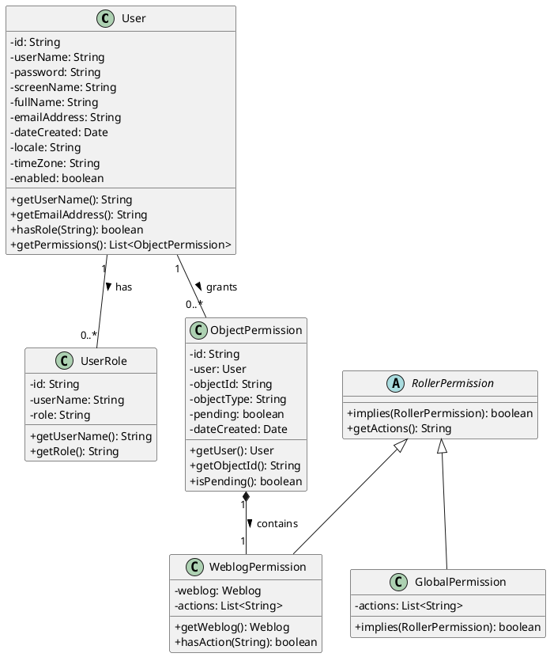

# Core Domain Model Class (Manual Analysis)

## Classes and Their Responsibilities

### User Class
The User class represents an individual user in the system. It stores all essential account-related information and helps manage authentication and access.

**Key responsibilities:**
- Store authentication details (username and password)
- Maintain user profile information (full name, email, locale preferences)
- Track account status (enabled / disabled)
- Record timestamps for account creation and updates
- Associate users with roles and permissions

### UserRole Class
The UserRole class defines system-level roles assigned to users. It supports role-based access control by linking users to predefined roles.

**Supported roles:**
- **Administrator**: Full system access and management
- **Editor**: Content creation and editing access
- **User**: Basic authenticated access

### WeblogPermission Class
The WeblogPermission class manages permissions at the individual weblog level. It allows precise control over what actions a user can perform on a specific weblog.

**Permission levels:**
- **Owner**: Full control, including deletion
- **Editor**: Can publish and manage content
- **Drafter**: Can create drafts but cannot publish

### GlobalPermission Class
The GlobalPermission class represents system-wide administrative permissions. These permissions apply across the entire application rather than to a single weblog.

### RollerPermission Interface
The `RollerPermission` interface is the base abstraction for all permission types. It provides a common structure for checking permissions in a consistent way.

### ObjectPermission Class
The `ObjectPermission` class manages permissions at a fine-grained object level. It allows permissions to be assigned to specific resources, not limited to weblogs.

## Relationships Between Classes

### Inheritance
- `WeblogPermission` implements `RollerPermission`
- `GlobalPermission` implements `RollerPermission`

### Association
- A `User` can have **0..*** `UserRole`
- A `User` can grant **0..*** `ObjectPermission`

### Composition
- `ObjectPermission` contains exactly **1** `WeblogPermission`  

## Class Diagram (PlantUML)

## Strengths

- **Interface-based design**  
`RollerPermission` enables polymorphism, making it easier to add new permission types in the future without changing existing permission-checking logic.This  improves extensibility and maintainability.

- **Clear separation of concerns**  
  Each permission class has a well-defined scope. `WeblogPermission` handles weblog-specific access, `GlobalPermission` manages system-wide privileges, and `ObjectPermission` focuses on object-level authorization. This separation keeps responsibilities clear, reduces complexity and makes the system easier to understand and debug.

- **Composition over inheritance**  
  By having `ObjectPermission` contain a `WeblogPermission` instead of inheriting from it, the design avoids deep inheritance hierarchies. This makes the model more flexible, as behavior can be changed by replacing composed objects rather than modifying class hierarchies. It also promotes reusability of permission logic.

- **Type safety**  
  Using strongly typed permission classes ensures that permissions are explicit and well-defined. This reduces the risk of invalid or ambiguous permission checks at runtime and makes the codebase safer and easier to reason about, especially as the system scales.

## Weaknesses

- **Tight coupling**  
  `ObjectPermission` directly references the `User` class, creating a strong dependency between them.

- **Bidirectional associations**  
  The two-way relationship between `User` and `ObjectPermission` can introduce circular dependencies. 

- **Rigid composition**  
  The requirement that `ObjectPermission` must always contain exactly one `WeblogPermission` reduces flexibility. It limits the ability to reuse `ObjectPermission` for other resource types where different or multiple permission types might be needed.

- **Inconsistent abstraction**  
  While `WeblogPermission` is used within `ObjectPermission` through composition, `GlobalPermission` stands alone. This inconsistency can make the permission model harder to extend and reason, as similar concepts are treated differently.

## Total Time Spent on Analysis

**6 hours**

