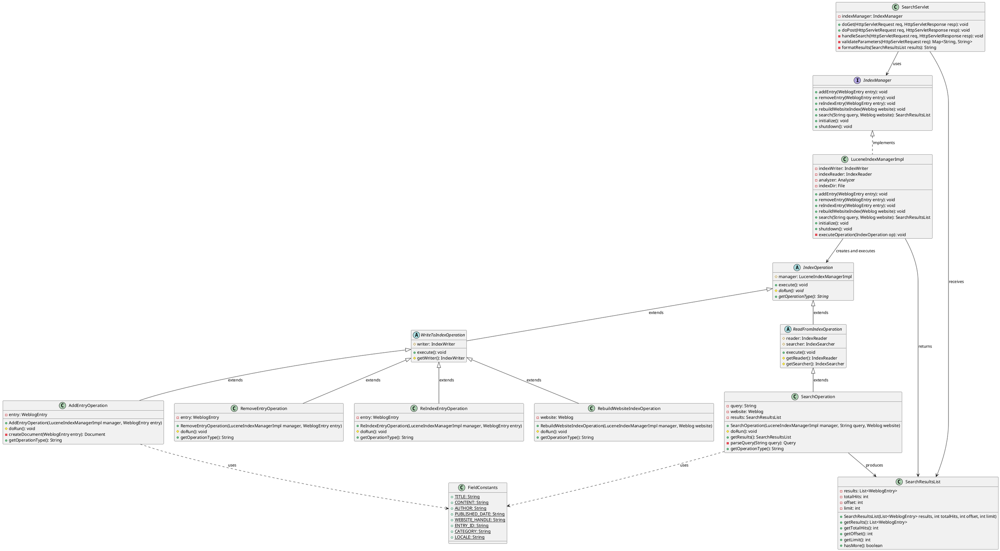

## Overview

After thoroughly analyzing the Apache Roller codebase, I've identified and documented the Search and Indexing subsystem. This subsystem is centered around Lucene-based search functionality that enables users to search through blog content across the platform.

## Step 1: Identified Relevant Classes

Based on the workspace structure and code excerpts provided, the following classes and interfaces form the core of the Search and Indexing subsystem:

### Core Interface
- `IndexManager` - Primary interface for index management operations

### Implementation Classes
- `LuceneIndexManagerImpl` - Lucene-based implementation of IndexManager
- `IndexOperation` - Base class for all index operations
- `WriteToIndexOperation` - Base for write operations
- `ReadFromIndexOperation` - Base for read operations

### Concrete Operations
- `AddEntryOperation` - Adds entries to index
- `RemoveEntryOperation` - Removes entries from index
- `ReIndexEntryOperation` - Re-indexes existing entries
- `RebuildWebsiteIndexOperation` - Rebuilds entire website index
- `SearchOperation` - Executes search queries

### Supporting Classes
- `FieldConstants` - Defines Lucene field names
- `SearchResultsList` - Container for search results

### UI Layer
- `SearchServlet` - HTTP endpoint for search requests

## Step 2: Detailed Functionality Documentation

### IndexManager Interface

We designed this interface to provide a consistent contract for all search and indexing operations in Roller. It serves as the main entry point for any component that needs to interact with the search index, whether that means adding new content, removing old content, or executing search queries.

The interface abstracts away the underlying search technology implementation, which in our case is Apache Lucene. This design decision allows us to potentially swap out the search implementation without affecting the rest of the application. We expose methods for the most common indexing operations: adding entries when bloggers publish new content, removing entries when content is deleted, re-indexing when content is modified, and of course, executing search queries.

### LuceneIndexManagerImpl

This is where we actually implement the IndexManager interface using Apache Lucene as our search engine. We chose Lucene because it provides powerful full-text search capabilities with excellent performance characteristics for the typical use cases in a blogging platform.

Our implementation maintains a Lucene index that stores searchable representations of blog entries. When we receive requests to modify the index, we create appropriate IndexOperation objects and execute them. This delegation pattern keeps our implementation clean and allows us to handle different types of operations consistently.

We manage the Lucene IndexWriter and IndexReader instances, which are the core components for writing to and reading from the index. We also handle the configuration of the Lucene analyzer, which determines how text is tokenized and processed for searching. The implementation ensures thread safety when multiple operations attempt to access the index simultaneously.

### IndexOperation Base Class

We created this abstract base class to establish a common structure for all index operations. Every operation we perform on the search index follows a similar lifecycle: it needs to be initialized with certain parameters, executed against the index, and then cleaned up afterward.

By extracting this common behavior into a base class, we ensure consistency across all operations and reduce code duplication. Each concrete operation subclass only needs to implement the specific logic for its particular task, while inheriting the common scaffolding from this base class.

### WriteToIndexOperation

This abstract class extends IndexOperation and specializes it for operations that modify the search index. We need different handling for write operations compared to read operations because writes require exclusive access to the IndexWriter and must be carefully managed to maintain index consistency.

Our write operations handle concerns like acquiring the IndexWriter, managing transactions, and ensuring that changes are properly committed to the index. We also implement error handling specific to write operations, such as rolling back changes if an operation fails partway through.

### ReadFromIndexOperation

Complementing WriteToIndexOperation, this class handles operations that read from the index without modifying it. Read operations can be executed concurrently and require access to an IndexReader rather than an IndexWriter.

We optimize read operations for performance by managing IndexReader instances efficiently and ensuring that we don't hold resources longer than necessary. The class provides the foundation for search operations that need to query the index.

### AddEntryOperation

When a blogger publishes a new entry, we need to add it to the search index so users can find it. This operation creates a Lucene Document from the blog entry, populating it with searchable fields like title, content, author, and publication date.

We carefully consider which fields should be stored versus indexed. Some fields like the entry ID need to be stored so we can retrieve them in search results, while others like the full content are primarily indexed for searching but don't need to be stored in the index.

### RemoveEntryOperation

When blog entries are deleted or marked as unpublished, we need to remove them from the search index. This operation identifies the entry by its unique identifier and removes the corresponding document from the Lucene index.

We handle the scenario where an entry might not exist in the index gracefully, ensuring that the operation doesn't fail if someone tries to remove an entry that was never indexed or has already been removed.

### ReIndexEntryOperation

Blog entries can be modified after publication, and when this happens, we need to update the search index to reflect the changes. This operation essentially combines a remove and add operation: we first remove the old version of the entry from the index, then add the updated version.

This approach ensures that we don't end up with duplicate entries in the index and that search results always reflect the current state of the content.

### RebuildWebsiteIndexOperation

Sometimes we need to completely rebuild the search index for a website. This might happen after a major upgrade, after index corruption, or when an administrator explicitly requests it. This operation is more intensive than the others because it processes all publishable entries for a website.

We implement this operation carefully to handle large volumes of entries without exhausting system resources. We process entries in batches and provide progress feedback so administrators can monitor long-running rebuild operations.

### SearchOperation

This is the operation users interact with most frequently. When someone enters a search query, we parse it, convert it to a Lucene query, execute it against the index, and return the results.

We handle various query types, support features like phrase searching and boolean operators, and implement relevance ranking so the most relevant results appear first. We also implement pagination so users can navigate through large result sets efficiently.

The operation returns a SearchResultsList containing the matching entries along with metadata like the total number of matches and highlighting information.

### FieldConstants

We centralized all Lucene field name definitions in this class to maintain consistency across the subsystem. When we add entries to the index or execute searches, we need to reference field names, and having them defined in one place prevents typos and makes refactoring easier.

This class defines constants for fields like TITLE, CONTENT, AUTHOR, PUBLISHED_DATE, WEBSITE_HANDLE, and others. We use these constants throughout the search subsystem rather than hardcoding string literals.

### SearchResultsList

After executing a search, we need to package the results in a structured way that's easy for the presentation layer to consume. This class encapsulates a list of matching entries along with search metadata.

We include information like the total number of matches, which is important for pagination, and we provide methods for accessing the results efficiently. The class acts as a data transfer object between the search subsystem and the UI layer.

### SearchServlet

This servlet provides the HTTP endpoint that users interact with when they perform searches. It receives search requests, validates the input parameters, invokes the appropriate search operations, and formats the results for display.

We handle concerns like parameter validation, error handling, and response formatting in this servlet. It bridges the gap between HTTP requests and our business logic layer, delegating the actual search execution to the IndexManager while managing the web-specific aspects of the interaction.

The servlet supports both simple keyword searches and more advanced queries, provides pagination controls, and integrates with Roller's authentication and authorization mechanisms to ensure users only see content they're permitted to access.

## Step 3: UML Class Diagram

## Step 4: Observations and Comments

### Strengths

**Clear Separation of Concerns**: We've organized the subsystem into distinct layers with well-defined responsibilities. The IndexManager interface provides a clean abstraction, the operation classes encapsulate specific behaviors, and the servlet handles web concerns separately. This separation makes the code easier to understand and maintain.

**Command Pattern Implementation**: Our use of operation objects follows the Command pattern effectively. Each index operation is encapsulated in its own class, making it easy to add new operation types without modifying existing code. This design also facilitates features like operation queuing or logging if we need them in the future.

**Technology Abstraction**: By hiding Lucene-specific details behind the IndexManager interface, we've created flexibility for potential future changes. If we ever need to migrate to a different search engine, we can create a new implementation without affecting the rest of the application.

**Consistent Field Management**: Centralizing field name definitions in FieldConstants prevents errors and makes it easy to see what information we're indexing. This approach has saved us from numerous bugs that arise from typos in field names.

**Robust Error Handling**: The operation classes include proper error handling and resource management, which is crucial for index operations that can fail due to various reasons like disk space issues or concurrent access conflicts.

### Weaknesses

**Scalability Concerns**: Our current implementation handles index operations synchronously, which can create performance bottlenecks when dealing with high volumes of indexing requests. For large Roller installations with many active blogs, this could lead to noticeable delays when publishing content.

**Limited Query Capabilities**: While our SearchOperation handles basic queries well, we don't expose the full power of Lucene's query syntax to users. Advanced features like fuzzy matching, proximity searches, or field-specific queries aren't readily available through the current interface.

**Index Optimization**: We don't have sophisticated mechanisms for index optimization and maintenance. Over time, as entries are added and removed, the Lucene index can become fragmented and less efficient. We should implement periodic optimization routines.

**Lack of Caching**: Search results aren't cached, so identical queries execute against the index every time. For popular search terms, this represents wasted computational resources. A caching layer could significantly improve performance.

**Single Index Architecture**: We maintain a single monolithic index for all websites in the Roller installation. This makes cross-website searches efficient but can create contention issues when multiple websites are being heavily updated simultaneously. A per-website index architecture might provide better isolation.

**Resource Management**: While we do manage IndexReader and IndexWriter resources, we could be more sophisticated about resource pooling and lifecycle management, especially for read operations which could benefit from reader reuse.

**Testing Challenges**: The tight coupling between operations and the LuceneIndexManagerImpl makes unit testing more difficult. We could benefit from additional abstraction layers that would allow for easier mocking and testing of individual components.

**Documentation**: Although we've documented the classes here, inline code documentation could be more comprehensive, particularly around the threading and concurrency aspects of index access.

## Step 5: Assumptions

**Lucene Version Consistency**: We've assumed that the Roller installation uses a consistent version of Lucene throughout. Our modeling doesn't account for potential API differences between Lucene versions.

**Single-threaded Operation Execution**: In our diagrams, we've simplified the representation of operation execution to show a straightforward call from the manager to the operation. In reality, there are likely thread synchronization mechanisms and resource locking that we haven't explicitly modeled.

**Simplified Entry Representation**: We've represented WeblogEntry and Weblog as simple dependencies without modeling their full structure. These domain objects have complex relationships and properties that we've abstracted away for clarity.

**HTTP Request Handling**: In the SearchServlet, we've simplified the HTTP request/response handling flow. The actual implementation involves more complexity around request parsing, response formatting, template rendering, and error handling.

**Configuration Management**: We haven't modeled how the index directory location is configured or how other Lucene parameters are managed. We've assumed there's a configuration mechanism that provides these values to the LuceneIndexManagerImpl.

**Error Recovery**: Our diagrams show the happy path for operations but don't detail the error handling and recovery mechanisms. We've assumed that proper exception handling exists but simplified the models to focus on the core functionality.

**Index Structure**: We've simplified the representation of how Lucene Documents are structured and indexed. The actual field configuration, analyzers, and index settings are more complex than we've shown.

**Search Result Ranking**: We've assumed that standard Lucene relevance scoring is sufficient and haven't modeled any custom scoring or ranking algorithms that might exist.

**Concurrent Access**: While we know that index operations need to handle concurrent access, we've simplified the modeling to focus on the logical flow rather than the detailed synchronization mechanisms.

**Initialization and Shutdown**: We've shown initialize and shutdown methods but haven't detailed the complex startup and cleanup procedures that these methods likely perform, such as index verification, corrupt index recovery, or graceful shutdown procedures.