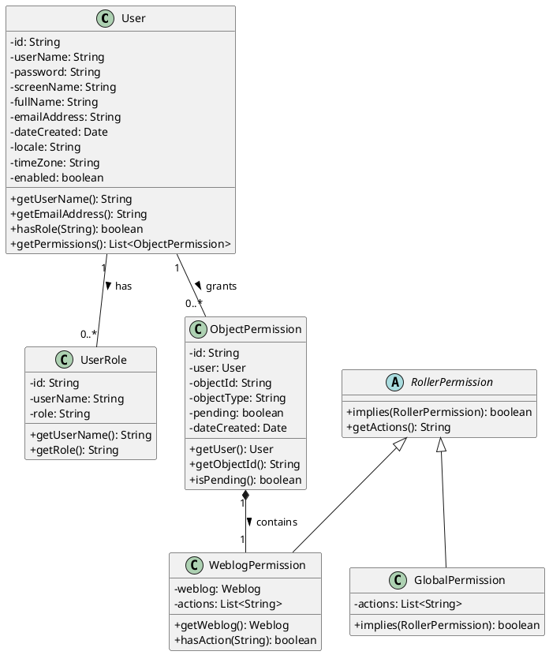
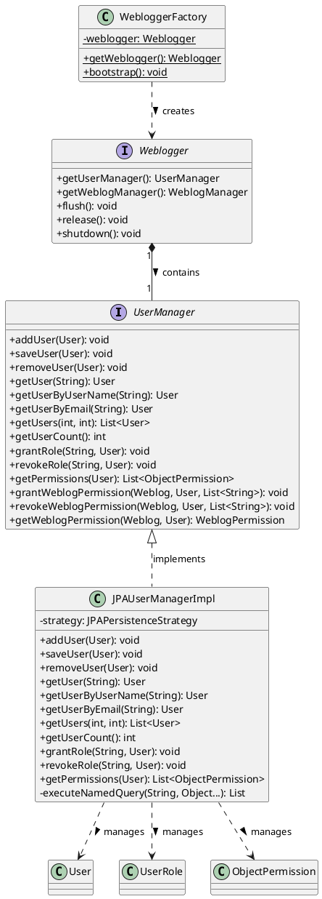
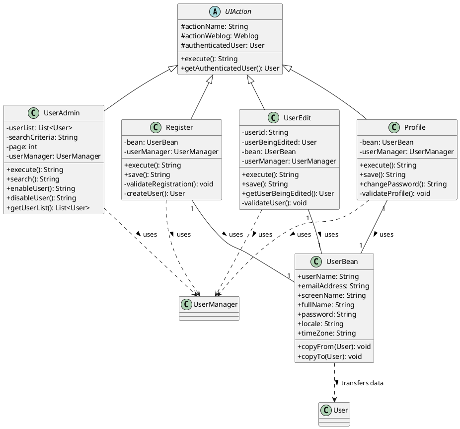
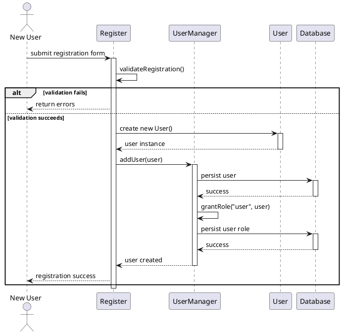
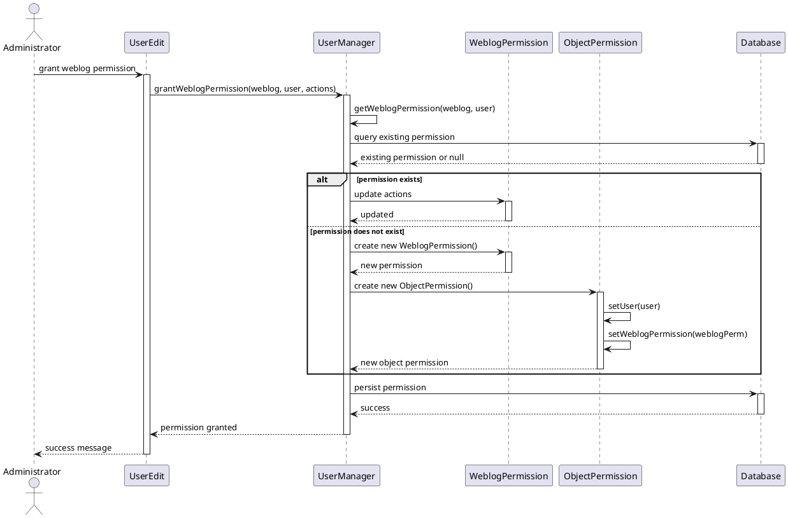
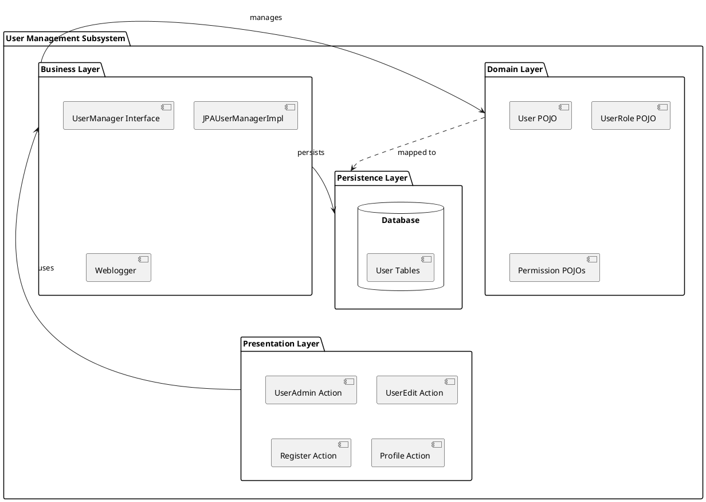

## Overview

We analyzed the User and Role Management subsystem of Apache Roller to understand how it handles user registration, permission management, and administrative controls. This subsystem is fundamental to the application's security model, controlling who can access what resources and perform which operations.

## Step 1: Identified Relevant Classes

Through analysis of the codebase, we identified the following key components:

### Core Domain Models (POJOs)
- `User` - Represents a user account
- `UserRole` - Represents user roles in the system
- `WeblogPermission` - Manages permissions for weblog access
- `GlobalPermission` - Handles system-wide permissions
- `RollerPermission` - Base permission abstraction
- `ObjectPermission` - Generic object-level permissions

### Business Logic Layer
- `UserManager` - Interface defining user management operations
- `JPAUserManagerImpl` - JPA implementation of user management
- `Weblogger` - Central business facade
- `WebloggerFactory` - Factory for obtaining Weblogger instances

### UI/Presentation Layer
- `UserAdmin` - Administrative user management interface
- `UserEdit` - User editing functionality
- `Register` - User registration handling
- `Profile` - User profile management

## Step 2: Detailed Functionality Documentation

### Core Domain Models

#### User Class
We maintain user account information as persistent entities in our system. The `User` class represents an individual user with their credentials, personal information, and preferences. Each user has a unique username and email address that we use for authentication and communication purposes.

Key responsibilities include:
- Storing authentication credentials (username and password)
- Managing user profile information (full name, email, locale preferences)
- Tracking account status (enabled/disabled state)
- Maintaining timestamps for account creation and updates
- Associating users with their roles and permissions

#### UserRole Class
We use the `UserRole` class to define what system-level roles a user possesses. This class acts as a junction between users and their assigned roles, allowing us to implement role-based access control at the application level.

The roles we support include:
- Administrator: Full system access and management capabilities
- Editor: Content creation and editing permissions
- User: Basic authenticated user access

#### WeblogPermission Class
Through the `WeblogPermission` class, we manage fine-grained access control for individual weblogs. This allows us to specify exactly what actions a user can perform on a specific weblog, implementing a sophisticated permission model.

We define three permission levels:
- Owner: Complete control over the weblog including deletion
- Editor: Can publish and manage content
- Drafter: Can create draft content but cannot publish

#### GlobalPermission Class
We implement system-wide administrative permissions through the `GlobalPermission` class. This allows us to grant users elevated privileges that apply across the entire application rather than to specific weblogs.

#### RollerPermission Class
The `RollerPermission` class serves as our base abstraction for all permission types in the system. We designed this to provide a consistent interface for checking permissions regardless of their scope or type.

#### ObjectPermission Class
We use `ObjectPermission` to handle permissions at a granular object level. This gives us flexibility to assign permissions to specific resources beyond just weblogs.

### Business Logic Layer

#### UserManager Interface
The `UserManager` interface defines the contract for all user-related operations in our system. We designed this interface to abstract the underlying persistence mechanism, allowing us to change implementations without affecting client code.

Core operations we provide:
- User creation and registration
- User retrieval by various criteria (username, email, ID)
- User updates and deletion
- Permission management
- Role assignment and verification
- User search and listing

#### JPAUserManagerImpl Class
We implement the UserManager interface through `JPAUserManagerImpl`, which uses Java Persistence API for database operations. This class handles all the complex database interactions needed for user management while maintaining transactional integrity.

Our implementation provides:
- CRUD operations for users using JPA entity management
- Query methods using JPQL for efficient data retrieval
- Permission checking and enforcement
- User authentication support
- Batch operations for administrative tasks

#### Weblogger Interface
The `Weblogger` class serves as our central business facade, providing unified access to all business managers including the UserManager. We use this to coordinate operations across different subsystems.

#### WebloggerFactory Class
Through `WebloggerFactory`, we implement the factory pattern to obtain Weblogger instances. This centralized factory approach allows us to manage the lifecycle of our business objects consistently.

### UI/Presentation Layer

#### UserAdmin Class
We built the `UserAdmin` class to provide administrators with comprehensive user management capabilities. This Struts2 action class handles requests for viewing, searching, and managing users at the system level.

Administrative functions we support:
- Viewing paginated lists of all users
- Searching users by various criteria
- Enabling and disabling user accounts
- Granting and revoking administrative privileges
- Bulk user operations

#### UserEdit Class
The `UserEdit` class provides the interface for administrators to modify user account details. We designed this to handle both viewing user information and processing updates while enforcing appropriate security constraints.

#### Register Class
We implement new user registration through the `Register` class. This action handles the entire registration workflow including validation, account creation, and initial setup.

Our registration process includes:
- Validation of user input (username uniqueness, email format, password strength)
- Account creation with appropriate default settings
- Optional email verification workflow
- Integration with authentication systems

#### Profile Class
Through `Profile`, we allow users to manage their own account information. This self-service capability reduces administrative overhead while giving users control over their profiles.

Users can manage:
- Personal information updates
- Password changes
- Locale and timezone preferences
- Email notification settings

## Step 3: UML Diagrams

### Class Diagram - Core Domain Model

### Class Diagram - Business Logic Layer

### Class Diagram - UI Layer

### Sequence Diagram - User Registration Flow

### Sequence Diagram - Permission Grant Flow

### Component Diagram - Subsystem Architecture

## Step 4: Observations and Comments

### Strengths

#### Separation of Concerns
We appreciate the clear separation between domain models, business logic, and presentation layers. This makes the codebase more maintainable and allows us to modify each layer independently without causing cascading changes throughout the system.

#### Flexible Permission Model
The permission system we have implemented demonstrates considerable flexibility. By separating global permissions from weblog-specific permissions and using an abstract RollerPermission base, we can easily extend the permission model to support new resource types or permission levels.

#### Interface-Based Design
We use interfaces extensively in the business layer, particularly with UserManager. This abstraction allows us to swap implementations without affecting client code, making testing easier and supporting multiple persistence strategies if needed.

#### Factory Pattern Usage
The WebloggerFactory provides a centralized way to obtain business manager instances. This simplifies dependency management and gives us a single point of control for initializing the application context.

### Weaknesses

#### Tight Coupling to JPA
Despite using interfaces, the system shows significant coupling to JPA specifics in the implementation layer. The JPAUserManagerImpl class directly depends on JPA entity management, which could make it difficult to adopt alternative persistence technologies.

#### Limited Validation Layer
We notice that validation logic is scattered across multiple layers. Some validation occurs in the UI actions, some in the business managers, and some implicitly through database constraints. This distribution makes it harder to ensure consistent validation rules across different entry points.

#### Password Management Concerns
Based on the code excerpts we examined, the password handling mechanism appears to store passwords directly in the User entity. We would prefer to see a more explicit separation between authentication concerns and user profile management, possibly with dedicated security services.

#### Permission Checking Complexity
The permission checking logic seems to require multiple database queries and object traversals. For a system that may need to check permissions frequently, this could become a performance bottleneck under high load.

#### Lack of Audit Trail
We do not see explicit support for tracking changes to user accounts and permissions. For administrative operations, having an audit log would be valuable for security and compliance purposes.

#### Transaction Boundary Concerns
The transaction management appears to be handled implicitly through the persistence layer. We would prefer more explicit transaction boundaries, especially for complex operations that involve multiple entities.

## Step 5: Assumptions

### Simplified Permission Hierarchy
We assumed a relatively flat permission structure in our diagrams. The actual implementation may include more complex permission inheritance or delegation patterns that we did not fully capture. We focused on the primary permission types mentioned in the requirements.

### Omitted Validation Details
We simplified the validation logic in our sequence diagrams. The actual validation likely involves more detailed checks including email format validation, username uniqueness constraints, password strength requirements, and other business rules that we abstracted away for clarity.

### Database Schema Abstraction
We treated the database as a black box in our diagrams. The actual database schema likely includes junction tables for many-to-many relationships, indexes for performance, and constraints for data integrity that we did not explicitly model.

### Authentication Integration
We assumed that authentication is handled externally or through a separate subsystem. While the User class stores credentials, we did not model the authentication flow, assuming it integrates with Spring Security or a similar framework that the codebase appears to use.

### Session Management
We simplified session handling in our diagrams. The actual implementation likely includes session management, caching of user permissions, and other performance optimizations that we abstracted for clearer conceptual understanding.

### Error Handling
We did not fully model exception handling and error recovery in our sequence diagrams. The actual implementation includes various exception types and error handling strategies that we simplified to focus on the happy path scenarios.

### Concurrency Considerations
We assumed single-threaded operation in our diagrams. The actual system must handle concurrent access to user accounts and permissions, likely using optimistic locking or other concurrency control mechanisms that we did not explicitly model.

### Email Verification Flow
We simplified the registration process in our sequence diagram. Based on the code structure, there appears to be support for email verification and activation workflows that we abstracted away to focus on the core registration flow.