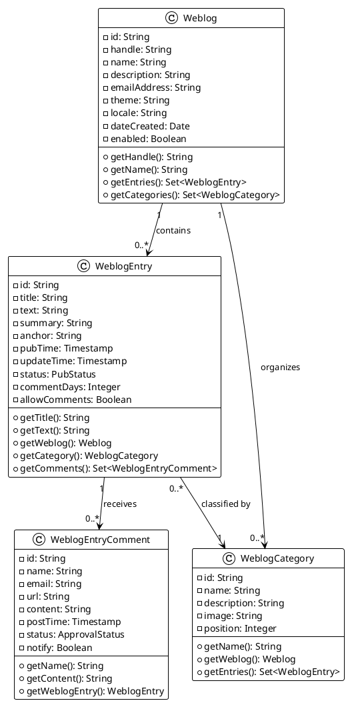
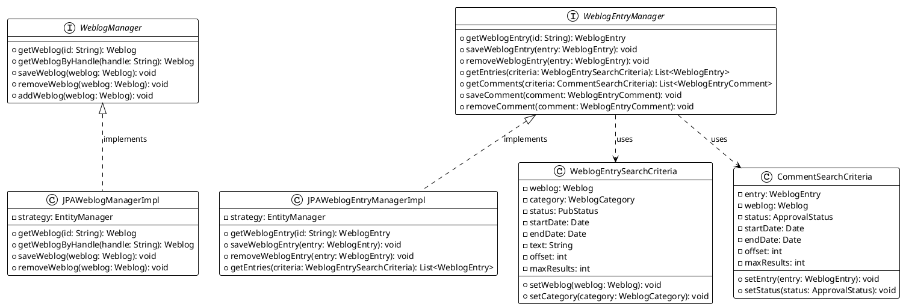
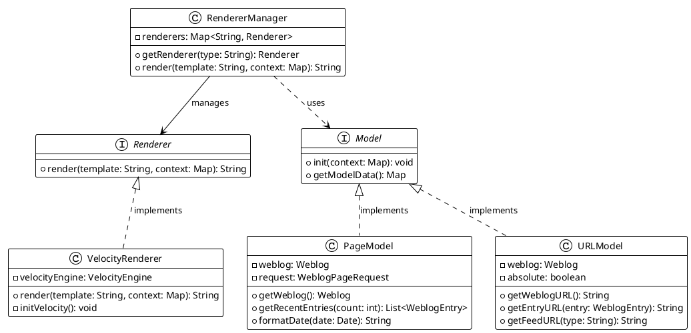
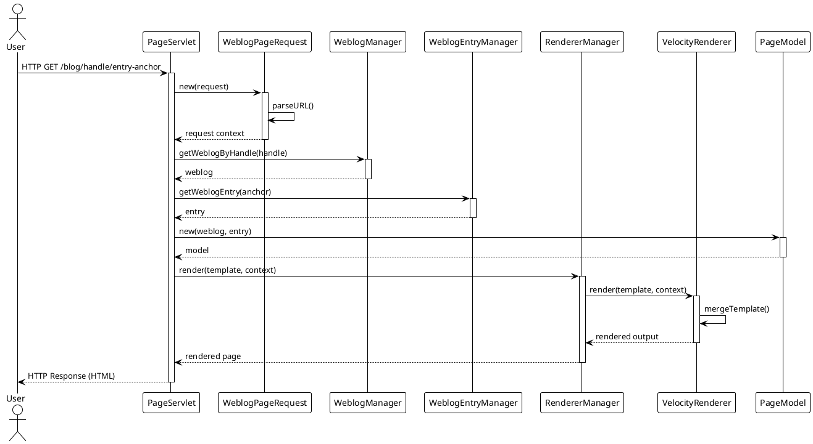
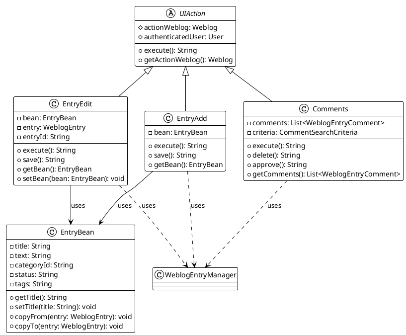
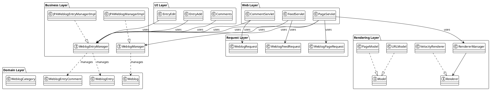

## Step 1: Identified Relevant Classes

After analyzing the workspace structure and the files mentioned in the prompt, I've identified the following key classes and interfaces for the Weblog & Content Subsystem:

### Core Domain Models (POJOs)
- **Weblog** - Represents a blog instance
- **WeblogEntry** - Represents individual blog posts
- **WeblogEntryComment** - Represents comments on blog entries
- **WeblogCategory** - Represents categories for organizing entries

### Business Logic Layer
- **WeblogManager** - Interface for weblog operations
- **JPAWeblogManagerImpl** - JPA implementation of WeblogManager
- **WeblogEntryManager** - Interface for entry and comment operations
- **JPAWeblogEntryManagerImpl** - JPA implementation of WeblogEntryManager

### Search and Query Components
- **WeblogEntrySearchCriteria** - Criteria builder for searching entries
- **CommentSearchCriteria** - Criteria builder for searching comments

### Rendering Engine
- **Renderer** - Interface for content rendering
- **VelocityRenderer** - Velocity-based template renderer
- **RendererManager** - Manages renderer instances

### View Models
- **Model** - Base interface for template models
- **PageModel** - Model for page rendering context
- **URLModel** - Provides URL generation utilities

### Request Processing
- **WeblogRequest** - Base request wrapper
- **WeblogPageRequest** - Request for weblog pages
- **WeblogFeedRequest** - Request for RSS/Atom feeds

### Servlet Layer
- **PageServlet** - Handles weblog page requests
- **CommentServlet** - Processes comment submissions
- **FeedServlet** - Generates RSS/Atom feeds

### UI Layer (Editor Actions)
- **EntryEdit** - Struts action for editing entries
- **EntryAdd** - Struts action for adding new entries
- **Comments** - Struts action for comment management

## Step 2: Detailed Documentation

### Core Domain Models

#### Weblog
We represent a blog instance in the system through this entity. Each weblog has a handle that serves as a unique identifier in URLs, along with properties like name, description, and theme information. The weblog acts as the container for all blog entries, categories, and associated media files. We maintain metadata such as creation date, locale settings, and various configuration flags that control the blog's behavior and appearance.

#### WeblogEntry
We model individual blog posts through this entity. Each entry belongs to a specific weblog and category, containing the actual content in both summary and full text formats. We track the publication status, allowing entries to exist in draft, published, or scheduled states. The entry maintains timestamps for creation and last update, along with properties for comment handling, search indexing, and social media integration. We support anchor-based permalinks and track the number of comments associated with each entry.

#### WeblogEntryComment
We capture reader interactions through this entity, which represents comments on blog entries. Each comment links back to its parent entry and stores the commenter's information including name, email, and optionally a website URL. We maintain the comment content, submission timestamp, and approval status. The system supports comment moderation, spam detection, and notification workflows through properties stored in this entity.

#### WeblogCategory
We organize blog entries through this hierarchical entity. Categories belong to a weblog and can have parent-child relationships, allowing for nested organization. We store the category name, description, and image, along with position information for ordering. The category serves as a classification mechanism, enabling readers to browse entries by topic.

### Business Logic Layer

#### WeblogManager
We define the contract for weblog management operations through this interface. It provides methods for creating, retrieving, updating, and deleting weblogs. We expose operations for managing weblog properties, themes, and permissions. The interface defines queries for finding weblogs by various criteria such as handle, user ownership, or enabled status. We also include methods for checking weblog name availability and managing weblog statistics.

#### JPAWeblogManagerImpl
We implement the weblog management interface using JPA for persistence. This class handles all database operations related to weblogs, including transaction management and query execution. We use the JPA EntityManager to perform CRUD operations and execute named queries for complex retrieval scenarios. The implementation ensures proper cascade operations for related entities and maintains referential integrity. We handle exceptions appropriately, converting JPA-specific exceptions to application-level exceptions.

#### WeblogEntryManager
We define the contract for managing blog entries and comments through this interface. It exposes methods for creating, updating, and deleting entries, along with sophisticated search capabilities through the WeblogEntrySearchCriteria class. We provide operations for managing entry categories, tags, and publish/schedule workflows. The interface includes methods for comment management, including retrieval, approval, and deletion. We define queries for fetching entries by various criteria such as status, date range, category, or tag.

#### JPAWeblogEntryManagerImpl
We implement entry and comment management using JPA persistence. This class handles the complexity of managing entries with their associated relationships including categories, tags, and comments. We execute searches using the criteria pattern, building dynamic JPA queries based on search parameters. The implementation manages the publishing workflow, handling status transitions and scheduled publication. We maintain integrity when deleting entries by properly handling comment relationships and updating statistics.

### Search Components

#### WeblogEntrySearchCriteria
We encapsulate search parameters for finding blog entries through this builder class. It allows us to specify filters for weblog, category, tags, status, date ranges, and text searches. We support pagination through offset and max results properties. The criteria object is passed to the manager layer, which translates it into appropriate database queries. We designed this as a fluent API, making it easy to construct complex search queries programmatically.

#### CommentSearchCriteria
We provide similar search capabilities for comments through this criteria class. It allows filtering by weblog, entry, status, spam status, and date ranges. We support searching for comments by content or commenter information. The criteria includes options for ordering results and limiting the result set. We use this abstraction to keep search logic separate from persistence concerns.

### Rendering Engine

#### Renderer
We define the contract for content rendering through this interface. It declares a single render method that takes a template and context map, producing rendered output. We abstract the underlying template engine, allowing for different rendering implementations. The interface enables us to swap rendering technologies without affecting the rest of the application.

#### VelocityRenderer
We implement the Renderer interface using Apache Velocity as the template engine. This class initializes the Velocity engine with appropriate configuration, including template loaders and resource management. We handle the rendering process by creating a Velocity context from the provided map, evaluating the template, and capturing the output. The implementation manages exceptions from the template engine, converting them to rendering-specific exceptions that the application can handle appropriately.

#### RendererManager
We manage renderer instances and coordinate the rendering process through this class. It maintains a registry of available renderers and selects the appropriate one based on template type or configuration. We handle caching of rendered content when appropriate and manage the lifecycle of renderer instances. The manager provides a central point for rendering operations, abstracting the complexity from calling code.

### View Models

#### Model
We define the base contract for template context objects through this interface. All view models implement this interface, which declares methods for initialization and providing model data to templates. We use these models to separate presentation logic from business logic, encapsulating the data preparation needed for rendering templates.

#### PageModel
We provide page-specific context through this view model. It exposes methods for accessing weblog information, entries, and other page-level data. We include utility methods for common template operations like date formatting, URL generation, and text manipulation. The model serves as the primary interface between templates and the application, providing a rich API for template authors.

#### URLModel
We centralize URL generation through this utility model. It provides methods for constructing URLs to various application resources including weblog pages, entries, feeds, and media files. We handle the complexity of URL strategy (relative vs absolute, preview vs production) within this model. The URL model ensures consistent URL generation across the application and simplifies template development.

### Request Processing

#### WeblogRequest
We wrap HTTP requests with weblog-specific context through this class. It parses the request URL to extract the weblog handle and other routing information. We validate the weblog exists and is accessible, setting up the request context for downstream processing. The class provides convenient access to the target weblog and authenticated user.

#### WeblogPageRequest
We extend WeblogRequest to handle page-specific routing through this class. It parses additional URL components to determine which page template to render. We extract parameters like category, date ranges, or entry anchors from the URL path. The request object makes this parsed information available to servlets and the rendering engine.

#### WeblogFeedRequest
We specialize request handling for feed generation through this class. It identifies the feed format (RSS or Atom) and category from the URL. We parse feed-specific parameters like the number of entries to include. The request provides all necessary information for generating properly formatted syndication feeds.

### Servlet Layer

#### PageServlet
We handle incoming requests for weblog pages through this servlet. It creates a WeblogPageRequest to parse the URL and identify the target page. We retrieve the appropriate page template and gather the necessary data through manager classes. The servlet constructs a rendering context with view models and delegates to the RendererManager for output generation. We handle caching headers and error conditions, ensuring proper HTTP responses.

#### CommentServlet
We process comment submissions and retrieval through this servlet. It validates the comment data, checks for spam using the configured spam prevention mechanisms, and persists the comment through the WeblogEntryManager. We handle comment preview functionality and notification workflows. The servlet ensures proper validation and security checks before accepting comments.

#### FeedServlet
We generate RSS and Atom feeds through this specialized servlet. It creates a WeblogFeedRequest to determine the feed parameters and format. We retrieve entries using the WeblogEntryManager with appropriate filters and limits. The servlet constructs the feed document using ROME library abstractions, setting proper headers for syndication. We handle caching and conditional GET requests for efficient feed delivery.

### UI Layer (Editor Actions)

#### EntryEdit
We handle the entry editing workflow through this Struts action. It loads an existing entry for modification, populating a form bean with entry data. We manage the form submission, validating input and persisting changes through the WeblogEntryManager. The action handles image uploads, category selection, and tag management. We support preview functionality and scheduling of entry publication.

#### EntryAdd
We manage the creation of new blog entries through this Struts action. It initializes a blank form for entry composition and processes the submission. We set default values for new entries and validate required fields. The action creates the entry through the WeblogEntryManager and handles the redirect to the edit page or entry list. We support saving entries as drafts or publishing immediately.

#### Comments
We provide comment management capabilities through this Struts action. It displays lists of comments filtered by various criteria using CommentSearchCriteria. We support bulk operations like approval, spam marking, or deletion of multiple comments. The action handles individual comment editing and provides access to commenter information. We implement pagination for large comment lists and provide filtering options.

## Step 3: UML Diagrams

### Core Domain Model Class Diagram

### Business Logic Layer Class Diagram

### Rendering Engine Class Diagram

### Request Processing and Servlet Layer Sequence Diagram

### UI Layer (Editor) Class Diagram

### Complete System Architecture Diagram

## Step 4: Observations and Comments

### Strengths

#### Separation of Concerns
We observe a clear separation between domain models, business logic, and presentation layers. The architecture follows a classic multi-tier pattern where each layer has well-defined responsibilities. This separation makes the codebase easier to maintain and test, as changes in one layer have minimal impact on others.

#### Interface-Based Design
We appreciate the extensive use of interfaces for manager classes. This design choice enables dependency injection, facilitates testing through mocking, and allows for alternative implementations without affecting client code. The abstraction between WeblogManager and JPAWeblogManagerImpl exemplifies this pattern well.

#### Template Engine Abstraction
We note that the rendering layer abstracts the underlying template engine through the Renderer interface. This design decision protects the application from vendor lock-in and makes it possible to switch template engines if needed. The VelocityRenderer implementation can coexist with other renderer implementations.

#### Rich Domain Model
We observe that domain entities like WeblogEntry and Weblog contain substantial business logic and maintain their relationships. This rich domain model approach keeps related behavior close to the data it operates on, making the code more cohesive and maintainable.

#### Search Criteria Pattern
We find the use of criteria objects for searching entries and comments to be a strength. This pattern encapsulates complex query logic and makes it easy to construct searches programmatically. The fluent API design of these criteria classes enhances code readability.

### Weaknesses

#### Tight Coupling to JPA
We observe that the JPAWeblogManagerImpl and JPAWeblogEntryManagerImpl classes are tightly coupled to JPA-specific concepts. While the interface provides abstraction, the implementation details leak through in exception handling and transaction management. This coupling makes it difficult to swap out the persistence mechanism.

#### Servlet-Based Architecture
We note that the application relies on traditional servlet architecture rather than more modern frameworks. This approach requires more boilerplate code and makes certain tasks like request validation, error handling, and content negotiation more manual. Modern frameworks provide these capabilities out of the box.

#### Limited Request Validation
We observe minimal validation logic in the request processing layer. The WeblogRequest and its subclasses focus primarily on parsing URLs but do not enforce security constraints or validate parameters comprehensively. This design pushes validation responsibility to the servlet layer, leading to potential duplication.

#### Mixed Responsibilities in Servlets
We notice that servlet classes handle multiple concerns including request processing, business logic orchestration, and response generation. The PageServlet, for instance, manages URL parsing, data retrieval, context preparation, and rendering. This mixing of responsibilities makes the servlets harder to test and maintain.

#### Struts Dependency in UI Layer
We observe that the editor actions are tightly coupled to the Struts framework. The UIAction base class and action classes extend Struts-specific types, making the UI layer difficult to port to other frameworks. This dependency also affects testability since testing requires Struts infrastructure.

#### Limited Caching Strategy
We find that caching appears to be handled ad-hoc within individual components rather than through a unified caching strategy. The RendererManager mentions caching but the details are not centralized. A more comprehensive caching layer could improve performance significantly.

#### Comment Processing Logic Duplication
We notice that comment validation and spam checking logic appears in multiple places. The CommentServlet handles submission validation, but similar logic may exist in the UI layer. This duplication increases maintenance burden and the risk of inconsistencies.

#### URL Strategy Complexity
We observe that URL generation involves multiple components including URLModel, various request classes, and servlets. While this distribution provides flexibility, it also makes it harder to understand and modify URL patterns. A centralized URL routing configuration would be clearer.

## Step 5: Assumptions

### Simplified Persistence Layer
We assumed that the JPA implementation uses standard entity manager operations without delving into the specifics of query construction, transaction boundaries, and exception translation. In reality, these implementations likely contain substantial code for building dynamic queries based on search criteria and handling various persistence scenarios.

### Omitted Security Concerns
We simplified our analysis by not modeling the security layer that surely exists in the actual implementation. Authentication, authorization checks, and permission validation are critical aspects of a blog system but were not represented in our class diagrams to keep them focused on the core functionality.

### Template Engine Configuration
We assumed that the VelocityRenderer initialization and configuration are straightforward. In practice, setting up Velocity requires configuring resource loaders, template caching, and various engine properties. We abstracted these details to focus on the rendering architecture.

### Request Processing Flow
We simplified the request processing sequence diagram by assuming a linear flow from servlet to manager to renderer. The actual implementation likely involves more steps including validation, error handling, caching checks, and conditional processing based on request parameters.

### UI Action Execution Context
We assumed that Struts actions execute in a straightforward manner without detailing the interceptor chain, validation framework, and result processing that Struts provides. These framework-specific details were omitted to focus on the application logic.

### Comment Workflow Complexity
We simplified the comment processing workflow by not modeling the complete spam detection, moderation queue, and notification system. These features likely involve additional components and integration points that we did not represent in our diagrams.

### Rendering Context Preparation
We assumed that preparing the rendering context involves simply creating view models and passing them to the renderer. The actual implementation likely includes more complex logic for gathering data, handling permissions, and managing session state.

### Feed Generation Details
We abstracted the complexity of RSS and Atom feed generation by assuming the FeedServlet handles it directly. The actual implementation likely uses specialized libraries like ROME and involves additional formatting and validation logic.

### Search Query Optimization
We assumed that the search criteria are directly translated into database queries without optimization. Real implementations would include query planning, index usage considerations, and performance tuning that we did not model.

### Error Handling and Recovery
We simplified our models by not explicitly showing exception handling, error recovery, and fallback mechanisms. Production code requires comprehensive error handling that we assumed exists but did not detail in our documentation or diagrams.